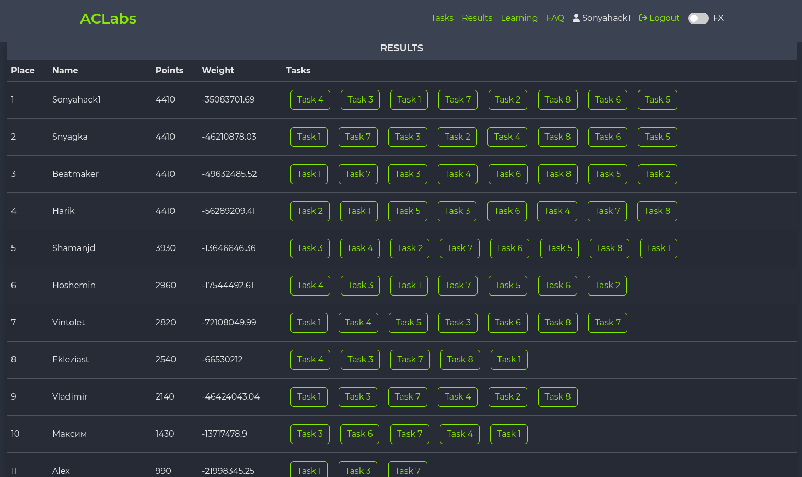

  

<a href="https://git.io/typing-svg">

<!-- social -->

  
  &#8287;&#8287;&#8287;&#8287;&#8287;
 
  &#8287;&#8287;&#8287;&#8287;&#8287;
 
  &#8287;&#8287;&#8287;&#8287;&#8287;
 
  &#8287;&#8287;&#8287;&#8287;&#8287;

  
  

---

### About Me

- I am a cybersecurity professional specializing in penetration testing, red team operations, and offensive security research. My work involves 𝗶𝗻𝘃𝗲𝘀𝘁𝗶𝗴𝗮𝘁𝗶𝗻𝗴 𝘃𝘂𝗹𝗻𝗲𝗿𝗮𝗯𝗶𝗹𝗶𝘁𝗶𝗲𝘀 𝗶𝗻 𝘄𝗲𝗯 𝗮𝗽𝗽𝗹𝗶𝗰𝗮𝘁𝗶𝗼𝗻𝘀, 𝗻𝗲𝘁𝘄𝗼𝗿𝗸𝘀, 𝗔𝗰𝘁𝗶𝘃𝗲 𝗗𝗶𝗿𝗲𝗰𝘁𝗼𝗿𝘆 𝗲𝗻𝘃𝗶𝗿𝗼𝗻𝗺𝗲𝗻𝘁𝘀, 𝗮𝗻𝗱 𝘀𝘆𝘀𝘁𝗲𝗺 𝗶𝗻𝘁𝗲𝗿𝗻𝗮𝗹𝘀. I enjoy learning new tools, finding creative solutions, and sharing my knowledge through `walkthroughs`.

- I solve machines and labs on various academic platforms - `HackTheBox`, `TryHackMe`, `PortSwigger` etc. and I write reports on the work I do.

---
<h2 align="center">📌 Repositories with Writeups</h2>

<table align="center">
   <colgroup>
    <col width="80">
    <col width="300">
    <col width="600">
  </colgroup>
  <thead>
    <tr>
      <th></th>
      <th>Repository</th>
      <th>Description</th>
    </tr>
  </thead>
  <tbody>
    <tr align="center">
      <td></td>
      <td><a href="https://github.com/sonyahack1/HackTheBox">Hack-The-Box Walkthroughs</a></td>
      <td>contains walkthroughs of HackTheBox machines</td>
    </tr>
    <tr align="center">
      <td></td>
      <td><a href="https://github.com/sonyahack1/PortSwigger">PortSwigger Labs</a></td>
      <td>contains walkthroughs of PortSwigger labs</td>
    </tr>
    <tr align="center">
      <td></td>
      <td><a href="https://github.com/sonyahack1/Try-Hack-Me">Try-Hack-Me Walkthroughs</a></td>
      <td>contains walkthroughs of TryHackMe machines</td>
    </tr>
    <tr align="center">
      <td></td>
      <td><a href="https://github.com/sonyahack1/Root-Me">Root-Me Challenges</a></td>
      <td>contains walkthroughs of Root-Me Challenges</td>
    </tr>
    <tr align="center">
      <td></td>
      <td><a href="https://github.com/sonyahack1/kids_2.0-Tasks">Kids 2.0 - Tasks</a></td>
      <td>contains walkthroughs of web-kids Challenges</td>
    </tr>
  </tbody>
</table>

---

<h2 align="center"> 🏁 CTF Activity </h2>

  

    <strong>
      
        
        ACLabs 02.07.2025–09.07.2025
      
    </strong>
  

   
  

    
  

---
### 💻 My favorite tools and technologies:

<table align="center">
  <tr>
   <td align="center" width="96">
        &nbsp;
       nmap
   </td>
    <td align="center" width="96">
        &nbsp;
       GitHub
   </td>
    <td align="center" width="96">
        &nbsp;
       Arch
   </td>
    <td align="center" width="96">
        &nbsp;
       Kali
   </td>
    <td align="center" width="96">
        &nbsp;
       Metasploit
   </td>
    <td align="center" width="96">
        &nbsp;
       WireShark
   </td>
    <td align="center" width="96">
        &nbsp;
       Bash
   </td>
    <td align="center" width="96">
        &nbsp;
       PowerShell
   </td>
    <td align="center" width="96">
        &nbsp;
       Docker
   </td>
  </tr>
  <tr>
    <td align="center" width="96">
        &nbsp;
       BurpSuite
   </td>
   <td align="center" width="96">
        &nbsp;
       BloodHound
   </td>
   <td align="center" width="96">
        &nbsp;
       sqlmap
   </td>
   <td align="center" width="96">
        &nbsp;
       Linux
   </td>
   <td align="center" width="96">
        &nbsp;
       vscode
   </td>
   </tr>
  </table>

---
<h2 align="center"> 📈 GitHub Activity & Stats </h2>

  
  

